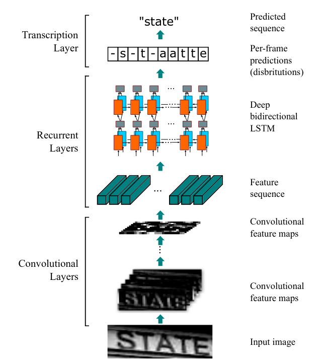
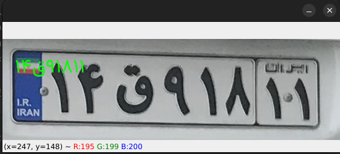
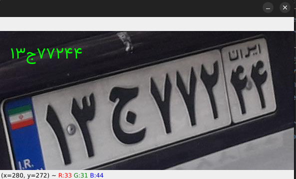

# CRNN-Pytorch

Pytorch implementation of the CRNN model.
In this repository I explain how to train a license plate-recognition model with pytorch-lightning.

## CRNN Architecture:


## Installation:

```commandline
pip install -r requirements.txt
```

## Dataset

Before training the model, it's a good practice to calculate the `mean` and `std` of the input dataset and therefore
normalize the model using proper values instead of merely normalizing with magical `0.5`. Before diving into the code
make sure that the dataset has the following characters:

```commandline
├── data-dir
│   ├── train
│   │  ├──<index_01>_<text>.jpg
│   │  ├──<index_02>_<text>.jpg
│   │  ├──...
│   ├── val
│   │  ├──<index_01>_<text>.jpg
│   │  ├──<index_02>_<text>.jpg
...
```

**NOTE:** Only `.jpg`, `.png`, and `.jpeg` extensions are supported!

Then checkout the `alphabets.py` module. It contains the alphabets characters that are required for training.
If the existing alphabets do not meet your requirements create a new dictionary containing your required alphabets and
then add it to the `ALPHABETS` variable with a specific name. You can get your character set using the following
command:

```commandline
python get_character_sets.py --data_directory <path-to-dataset>
```
The output will be like the following: 
```commandline
[INFO] characters: +ابتثجدزسشصطعقلمنهوپگی۰۱۲۳۴۵۶۷۸۹
```

Run the following command to get the `mean`, `std` and `n_classes` of your input dataset:

```commandline
python dataset.py --dataset_dirtrain_directory <your-train-dir> --alphabet_name FA_LPR --batch_size 128
```
or

```commandline
python dataset.py --train_directory <your-train-dir> --alphabets +ابتثجدزسشصطعقلمنهوپگی۰۱۲۳۴۵۶۷۸۹  --batch_size 128
```

The output should be like below:

```commandline
[INFO] MEAN: [0.4845], STD: [0.1884]
[INFO] N_CLASSES: 35 ---> ابپتشثجدزسصطعفقکگلمنوهی+۰۱۲۳۴۵۶۷۸۹
```

Run the following command to get the optimal img_w. For longer label length the img_w should be longer than usual, unless
the `ctc-loss` returns nan.
```commandline
python get_optimum_img_w.py --alphabets ابپتشثجدزسصطعفقکگلمنوهی+۰۱۲۳۴۵۶۷۸۹ --data_directory <your-train-dir>
```
the output should be like below:
```commandline
[INFO] max_length of this dataset is 8, optimal img_w is: 100
```

Or get all stats using the following command:
```commandline
python get_all_stats.py --data_directory <your-dataset-dir>
```
Get the stats and replace them with values provided for `img_w`, `MEAN`, `STD`, and `N_CLASSES` in the `settings.py` module under
the `BasicConfig` class, or simply pass them as input arguments.

## Train:
After modifying the aforementioned configs, run the following command to train the model:
```commandline
python train.py
```
or 

```commandline
python train.py --img_w 100 --n_workers 8 --train_directory <your-trian-dir> --val_directory <your-val-dir> --mean 0.4845 --std 0.1884 --alphabets ابپتشثجدزسصطعفقکگلمنوهی+۰۱۲۳۴۵۶۷۸۹ 
```

To see all the configs:
```commandline
python train.py -h
```
Output
```commandline
optional arguments:
  -h, --help            show this help message and exit
  --train_directory TRAIN_DIRECTORY
                        path to the dataset, default: ./dataset
  --val_directory VAL_DIRECTORY
                        path to the dataset, default: ./dataset
  --output_dir OUTPUT_DIR
                        path to the output directory, default: ./output
  --epochs EPOCHS       number of training epochs
  --device DEVICE       what should be the device for training, default is cuda
  --mean MEAN [MEAN ...]
                        dataset channel-wise mean
  --std STD [STD ...]   dataset channel-wise std
  --img_w IMG_W         dataset img width size
  --n_workers N_WORKERS
                        number of workers used for dataset collection
  --batch_size BATCH_SIZE
                        batch size number
  --alphabets ALPHABETS
                        alphabets used in the process

```

## Inference
For inference run the following code:
```commandline
python crnn_inference.py --model_path {path-to-your-output-dir}/best.ckpt --img_path sample_images/۱۴ق۹۱۸۱۱_7073.jpg
```
The output should be like the following:
```commandline
۱۴ق۹۱۸۱۱
```

Image examples:





### Sample Persian Dataset is avalable by Amirkabir University of Technology in the following link:
https://ceit.aut.ac.ir/~keyvanrad/download/ML971/project/

Password: ML971Data

### Labeled Dataset
https://github.com/Vargha-Kh/crnn-pytorch/releases/tag/Persian-licence-plate-recognition

### Foot-Notes:
1. For labeling tool checkout my project:
https://github.com/pooya-mohammadi/ocr-labeling-tool

## Forked repositories:
1. https://github.com/Vargha-Kh/crnn-pytorch

# References

1. https://github.com/pooya-mohammadi/deep_utils
2. https://github.com/AryanShekarlaban/
3. https://arxiv.org/pdf/1507.05717.pdf


#
